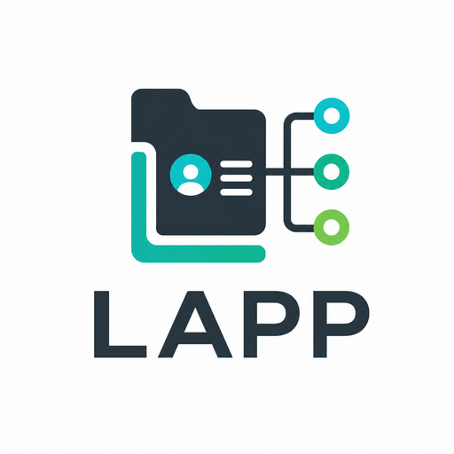

<p align="center">
  
</p>

<h1 align="center">LAPP</h1>

<p align="center">
  <strong>Local AI Provider Profiles</strong>
</p>

<p align="center">
  A lightweight local provider-profile convention for AI applications.
</p>

<p align="center">
  <a href="./README.zh-CN.md">简体中文</a>
  ·
  <a href="./README.en.md">English</a>
  ·
  <a href="./spec.en.md">Specification</a>
  ·
  <a href="./examples/en/full/.lapp">Example</a>
</p>

<p align="center">
  <a href="./LICENSE"></a>
  
  
</p>

---

LAPP is a tiny file-based convention for sharing AI provider configuration on one machine.

Instead of asking every AI app to configure DeepSeek, Kimi, OpenAI, MiniMax, SiliconFlow, OpenRouter, and other providers again and again, LAPP gives applications a common place to look:

```text
~/.lapp/
```

LAPP does **not** run a local service, proxy requests, manage billing, enforce fallback, or become another gateway. It only describes what providers and models the user already has.

The default root is `~/.lapp`. Applications may support `LAPP_HOME` as a root-directory override for workspaces, CI, containers, or managed environments. `LAPP_HOME` is a location override, not a secrecy mechanism.

## Why

AI applications keep reimplementing the same provider settings page:

- API keys
- base URLs
- protocol adapters
- model IDs and aliases
- default models
- model capabilities

LAPP keeps that shared profile data in a predictable local directory so applications can discover it instead of asking users to type it again.

## Minimal Shape

The smallest useful LAPP profile is just one provider:

```text
~/.lapp/
└── providers/
    └── deepseek/
        ├── provider.json
        └── models.json
```

```json
{
  "schemaVersion": "1.0",
  "id": "deepseek",
  "protocol": "openai-chat-completions",
  "baseUrl": "https://api.deepseek.com",
  "auth": {
    "secret": "env://DEEPSEEK_API_KEY"
  }
}
```

```json
{
  "schemaVersion": "1.0",
  "models": [
    {
      "id": "deepseek-v4-flash",
      "source": "manual",
      "type": "chat",
      "capabilities": ["chat", "stream"]
    }
  ]
}
```

A minimal LAPP v1 application starts by scanning:

```text
~/.lapp/providers/*/provider.json
```

For each provider, it reads `id`, `protocol`, `baseUrl`, and `auth.secret`, then reads the sibling `models.json` for model discovery. `global.json` is optional; it stores user or environment defaults, not the model list itself.

## Directory Layout

```text
~/.lapp/
├── manifest.json
├── providers/
│   └── {providerId}/
│       ├── provider.json
│       └── models.json
└── global.json
```

- `provider.json`: required provider profile
- `models.json`: provider model list, aliases, and capabilities; recommended for useful discovery
- `global.json`: optional default chat, embedding, speech, and video models
- `manifest.json`: optional root metadata

## Core Protocols

LAPP v1 recommends support for:

- `openai-chat-completions`
- `openai-responses`
- `anthropic-messages`

Other protocols can be added as extension strings, such as `gemini-generate-content`, `ollama`, or `minimax-api`.

## Examples

- [Minimal example](./examples/en/minimal/.lapp)
- [Full example](./examples/en/full/.lapp)
- [中文最小示例](./examples/zh-CN/minimal/.lapp)
- [中文完整示例](./examples/zh-CN/full/.lapp)

The full example includes:

- DeepSeek for default chat
- SiliconFlow for embeddings
- MiniMax for text-to-speech and video generation
- Kimi coding-plan style `User-Agent` headers

## Security Boundary

LAPP is not a secret vault. It standardizes where local AI provider profiles can be found; it does not prevent an untrusted local application or malware from reading files the user can read.

This is the same class of risk as `.env` files, cloud credentials, SSH keys, npm tokens, and other developer-machine secrets. `LAPP_HOME` can move the profile directory for workspace or environment separation, but it is not a secrecy mechanism.

For production credentials, use a proper secret manager, KMS, vault, workload identity, trusted broker, server-side gateway, scoped keys, rotation, and audit controls. See [Security Guidance](./security.en.md).

## Reference Validator

This repository includes a read-only reference validator:

```bash
node tools/validator/lapp-validate.mjs examples/en/full/.lapp
```

The validator checks directory shape, JSON/JSONC parsing, required provider fields, default references, model aliases, and common secret/header footguns. It never modifies `.lapp` files and never calls provider APIs.

## Documentation

| Topic | English | Chinese |
| --- | --- | --- |
| Specification | [spec.en.md](./spec.en.md) | [spec.zh-CN.md](./spec.zh-CN.md) |
| Implementation | [implementation.en.md](./implementation.en.md) | [implementation.zh-CN.md](./implementation.zh-CN.md) |
| Security | [security.en.md](./security.en.md) | [security.zh-CN.md](./security.zh-CN.md) |
| References | [references.en.md](./references.en.md) | [references.zh-CN.md](./references.zh-CN.md) |
| Schemas | [schema/](./schema/) | [schema/](./schema/) |
| Validator | [tools/validator/](./tools/validator/) | [tools/validator/](./tools/validator/) |

## License

The LAPP specification, schemas, examples, and logo concept are licensed under the [MIT License](./LICENSE).
